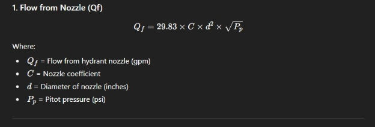
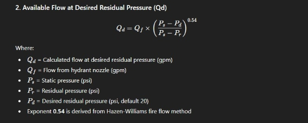
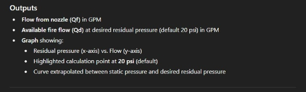
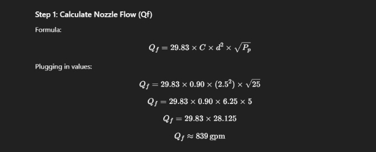
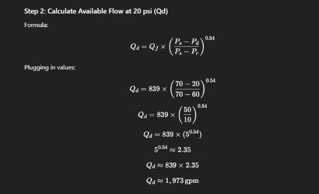

**Custom Fire Hydrant Flow Test Calculator – Development Requirements**

**Purpose**

Develop a web-based calculator (similar in functionality to:

- [HyCalc](http://www.firehydrant.org/info/hycalc.html?utm_source=chatgpt.com)
- [USFA Fire Flow Calculator](https://www.usfa.fema.gov/wui/fire-flow-calculator/?utm_source=chatgpt.com)

The calculator will compute fire hydrant flow test results using the **Hazen-Williams formula** and generate a **graphical representation** of the results at 20 psi (or user-defined residual pressure).

-----
**Inputs Required**

1. **Static Pressure (Ps)** – psi\
   (Measured at the residual hydrant before flowing water)
1. **Residual Pressure (Pr)** – psi\
   (Measured at the residual hydrant while water is flowing)
1. **Pitot Pressure (Pp)** – psi\
   (Measured at the flow hydrant nozzle with pitot gauge)
1. **Nozzle Diameter (d)** – inches\
   (Inside diameter of the hydrant outlet where pitot pressure is measured; typically 2.5", 4.5", etc.)
1. **Hydrant Coefficient (C)** – unitless\
   (Discharge coefficient based on nozzle type, typically 0.90 for rounded outlets, 0.80 for square outlets, etc.)
1. **Desired Residual Pressure (Pd)** – psi\
   (Default 20 psi, but editable by user)

**Formulas to Implement:\
\
**

\
\
\
**Graph Requirements**

- Must dynamically plot a flow vs. residual pressure curve based on input data.
- X-axis: Residual Pressure (psi).
- Y-axis: Flow (gpm).
- Display calculated flow at 20 psi (or user’s selected Pd) as a labeled point.
- Export option to **PNG/PDF** for reports.
-----
**Additional Features (Optional Enhancements)**

- Input validation & error handling (e.g., reject if residual ≥ static).
- Mobile-friendly design for field use.
- Save/export test results with metadata (hydrant ID, date, location).
- Option to add multiple hydrants for side-by-side comparison.
-----
**Implementation Notes**

- Follow **NFPA 291** methodology.
- Ensure calculations are accurate to at least 2 decimal places.
- Keep UI clean and simple with clear step-by-step inputs.
- Consider using **Chart.js** or **D3.js** for graphing.\
\
  **Fire Hydrant Flow Test Calculator – UI Wireframe**
- -----
- **1. Header**
- Title: **Fire Hydrant Flow Test Calculator**
- Subtitle: “Based on Hazen-Williams Formula (NFPA 291)”
- -----
- **2. Input Section (Form)**
- Organized in a clean grid for readability (2 columns on desktop, 1 column on mobile).
- **Input Fields:**
- Static Pressure (Ps) – [Text Box, psi]
- Residual Pressure (Pr) – [Text Box, psi]
- Pitot Pressure (Pp) – [Text Box, psi]
- Nozzle Diameter (d) – [Dropdown: 2.5", 4.5", Custom]
- Hydrant Coefficient (C) – [Dropdown: 0.80 (Square Edge), 0.90 (Rounded), Custom]
- Desired Residual Pressure (Pd) – [Text Box, default 20 psi]
- **Buttons:**
- [Calculate]
- [Reset]
- -----
- **3. Results Section**
- After clicking **Calculate**, display results in a card-style box:
- **Nozzle Flow (Qf):** xxx gpm
- **Available Flow @ Pd (Qd):** xxx gpm
- (Optional) Efficiency Check / Validation Message
- -----
- **4. Graph Section**
- Interactive chart displayed below results.
- **Graph Specs:**
- X-axis: Residual Pressure (psi)
- Y-axis: Flow (gpm)
- Curve: Flow vs. residual pressure line
- Highlight: Point at **20 psi (default)** or user-selected Pd
- Tooltips: Show (Pressure, Flow) when hovering points
- Legend: “Flow Curve” + “Flow @ Pd”
- **Export Options:**
- [Download Graph as PNG]
- [Download Report as PDF]
- -----
- **5. Footer**
- Small note: “Calculations based on Hazen-Williams formula, NFPA 291”
- Link: “More Info” → could open a modal or external reference

\
\
  **Sample Fire Hydrant Flow Test Case**

  **Input Values**

- **Static Pressure (Ps):** 70 psi
- **Residual Pressure (Pr):** 60 psi
- **Pitot Pressure (Pp):** 25 psi
- **Nozzle Diameter (d):** 2.5 in
- **Hydrant Coefficient (C):** 0.90 (rounded outlet)
- **Desired Residual Pressure (Pd):** 20 psi

  

**Step 3: Expected Outputs**

- **Nozzle Flow (Qf):** ~839 gpm
- **Available Flow at 20 psi (Qd):** ~1,973 gpm
-----
**Step 4: Graph Expectations**

- X-axis: Residual Pressure (psi)
- Y-axis: Flow (gpm)
- Curve should show flow increasing as residual pressure decreases.
- The **highlighted point at 20 psi** should display:
  - Residual Pressure = 20 psi
  - Flow ≈ 1,973 gpm

